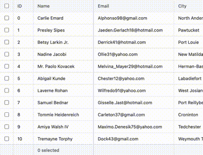

# virtua

   [](https://bestofjs.org/projects/virtua) [](https://deepwiki.com/inokawa/virtua) [](https://github.com/inokawa/virtua/actions/workflows/check.yml) [](https://github.com/inokawa/virtua/actions/workflows/demo.yml)

> A zero-config, fast and small virtual list, grid and masonry component for [React](https://github.com/facebook/react), [Vue](https://vuejs.org/), [Solid](https://www.solidjs.com/), [Svelte](https://svelte.dev/) and [Angular](https://angular.dev/).

 

If you want to check the difference with the alternatives right away, [see comparison section](#comparison).

## Motivation

This project is a challenge to rethink virtualization. The goals are...

- **Zero-config virtualization:** This library is designed to give the best performance without configuration. It also handles common hard things in the real world (dynamic size measurement, scroll position adjustment while reverse scrolling and imperative scrolling, iOS support, etc).
- **Fast:** Natural virtual scrolling needs optimization in many aspects (eliminate frame drops by reducing CPU usage and GC, reduce [synchronous layout recalculation](https://gist.github.com/paulirish/5d52fb081b3570c81e3a), reduce visual jumps on repaint, optimize with CSS, optimize for JIT, optimize for frameworks, etc). We are trying to combine the best of them.
- **Small:** Its bundle size should be small as much as possible to be friendly with modern web development. Currently components start from ~3kB gzipped and are tree-shakeable.
- **Flexible:** Aiming to support many usecases - fixed size, dynamic size, horizontal scrolling, reverse scrolling, table, masonry, RTL, mobile, infinite scrolling, scroll restoration, DnD, keyboard navigation, sticky and more. See [live demo](#demo).
- **Framework agnostic:** [React](https://react.dev/), [Vue](https://vuejs.org/), [Solid](https://www.solidjs.com/), [Svelte](https://svelte.dev/) and [Angular](https://angular.dev/) are supported. We could support other frameworks in the future.

## Demo

https://inokawa.github.io/virtua/

## Install

```sh
npm install virtua
```

If you want to support legacy browsers, you need polyfills.

- [ResizeObserver](https://caniuse.com/?search=resizeobserver) is always required (e.g. [@juggle/resize-observer](https://github.com/juggle/resize-observer#switching-between-native-and-polyfilled-versions)).
- [Scroll methods on elements](https://caniuse.com/element-scroll-methods) are always required (e.g. [element-scroll-polyfill](https://github.com/idmadj/element-scroll-polyfill)).
- [CSS scroll-behavior](https://caniuse.com/?search=scroll-behavior) is required only if you call `scrollToIndex` with `smooth: true` (e.g. [scroll-behavior-polyfill](https://github.com/wessberg/scroll-behavior-polyfill)).
- [CSS inset-inline-start](https://caniuse.com/mdn-css_properties_inset-inline-start) is required only if you set `horizontal: true` or use `VMasonry`. It cannot be polyfilled so use `virtua@<=0.50` instead.
- [CSS subgrid](https://caniuse.com/css-subgrid) is required for VGrid.

## Getting started

### React

`react >= 16.14` is required.

If you use ESM and webpack 5, use react >= 18 to avoid [Can't resolve `react/jsx-runtime` error](https://github.com/facebook/react/issues/20235).

```tsx
import { VList } from "virtua";

const sizes = [20, 40, 80, 77];
const data = Array.from({ length: 1000 }).map((_, i) => ({
  id: i,
  size: sizes[i % 4],
}));

export const App = () => {
  return (
    <VList data={data} style={{ height: 800 }}>
      {(item) => (
        <div
          key={item.id}
          style={{
            height: item.size,
            background: "white",
            borderBottom: "solid 1px #ccc",
          }}
        >
          {item.id}
        </div>
      )}
    </VList>
  );
};
```

You can also pass elements as `children` directly instead of `data`.

### Vue

`vue >= 3.2` is required.

```vue
<script setup>
import { VList } from "virtua/vue";

const sizes = [20, 40, 80, 77];
const data = Array.from({ length: 1000 }).map((_, i) => ({
  id: i,
  size: sizes[i % 4],
}));
</script>

<template>
  <VList :data="data" :style="{ height: '800px' }" #default="{ item }">
    <div
      :key="item.id"
      :style="{
        height: item.size + 'px',
        background: 'white',
        borderBottom: 'solid 1px #ccc',
      }"
    >
      {{ item.id }}
    </div>
  </VList>
</template>
```

### Solid

`solid-js >= 1.0` is required.

```tsx
import { VList } from "virtua/solid";

const sizes = [20, 40, 80, 77];
const data = Array.from({ length: 1000 }).map((_, i) => ({
  id: i,
  size: sizes[i % 4],
}));

export const App = () => {
  return (
    <VList data={data} style={{ height: "800px" }}>
      {(item) => (
        <div
          style={{
            height: item.size + "px",
            background: "white",
            "border-bottom": "solid 1px #ccc",
          }}
        >
          {item.id}
        </div>
      )}
    </VList>
  );
};
```

### Svelte

`svelte >= 5.0` is required.

```svelte
<script lang="ts">
  import { VList } from "virtua/svelte";

  const sizes = [20, 40, 80, 77];
  const data = Array.from({ length: 1000 }).map((_, i) => ({
    id: i,
    size: sizes[i % 4],
  }));
</script>

<VList {data} style="height: 800px;" getKey={(item) => item.id}>
  {#snippet children(item)}
    <div
      style="
        height: {item.size}px;
        background: white;
        border-bottom: solid 1px #ccc;
      "
    >
      {item.id}
    </div>
  {/snippet}
</VList>
```

### Angular

`@angular/core >= 20` is required. The components are zoneless-ready and work with both zone.js and [`provideZonelessChangeDetection`](https://angular.dev/api/core/provideZonelessChangeDetection).

```ts
import { Component } from "@angular/core";
import { VList } from "virtua/angular";

const sizes = [20, 40, 80, 77];

@Component({
  selector: "app-root",
  imports: [VList],
  template: `
    <virtua-vlist [data]="data" [getKey]="getKey" style="height: 800px;">
      <ng-template let-item>
        <div
          [style.height.px]="item.size"
          style="background: white; border-bottom: solid 1px #ccc;"
        >
          {{ item.id }}
        </div>
      </ng-template>
    </virtua-vlist>
  `,
})
export class App {
  protected readonly data = Array.from({ length: 1000 }).map((_, i) => ({
    id: i,
    size: sizes[i % 4],
  }));
  protected readonly getKey = (item: { id: number }) => item.id;
}
```

### Other bindings

- [vanilla-virtua](https://github.com/aabccd021/vanilla-virtua): virtua for vanilla js

## Usage

The examples are written in React, but the same components and props are available in all frameworks.

### Horizontal scroll

```tsx
import { VList } from "virtua";

const sizes = [20, 40, 80, 77];
const data = Array.from({ length: 1000 }).map((_, i) => ({
  id: i,
  size: sizes[i % 4],
}));

export const App = () => {
  return (
    <VList data={data} style={{ height: 400 }} horizontal>
      {(item) => (
        <div
          key={item.id}
          style={{
            width: item.size,
            background: "white",
            borderRight: "solid 1px #ccc",
          }}
        >
          {item.id}
        </div>
      )}
    </VList>
  );
};
```

### Custom scroll container

`VList` is a recommended solution which works like a drop-in replacement of simple list built with scrollable `div` (or removed [virtual-scroller element](https://github.com/WICG/virtual-scroller)). For more complicated styling or markup, use `Virtualizer`.

```tsx
import { Virtualizer } from "virtua";

const sizes = [20, 40, 80, 77];
const data = Array.from({ length: 1000 }).map((_, i) => ({
  id: i,
  size: sizes[i % 4],
}));
const headerHeight = 40;

export const App = () => {
  return (
    <div
      style={{
        height: 800,
        overflowY: "auto",
        // opt out browser's scroll anchoring on header/footer because it will conflict with scroll anchoring of virtualizer
        overflowAnchor: "none",
      }}
    >
      <div style={{ height: headerHeight }}>header</div>
      <Virtualizer data={data} startMargin={headerHeight}>
        {(item) => (
          <div
            key={item.id}
            style={{
              height: item.size,
              background: "white",
              borderBottom: "solid 1px #ccc",
            }}
          >
            {item.id}
          </div>
        )}
      </Virtualizer>
      <div style={{ height: 600 }}>footer</div>
    </div>
  );
};
```

### Window scroll

```tsx
import { WindowVirtualizer } from "virtua";

const sizes = [20, 40, 80, 77];
const data = Array.from({ length: 1000 }).map((_, i) => ({
  id: i,
  size: sizes[i % 4],
}));

export const App = () => {
  return (
    <div style={{ padding: 200 }}>
      <WindowVirtualizer data={data}>
        {(item) => (
          <div
            key={item.id}
            style={{
              height: item.size,
              background: "white",
              borderBottom: "solid 1px #ccc",
            }}
          >
            {item.id}
          </div>
        )}
      </WindowVirtualizer>
    </div>
  );
};
```

### Tabular data

For data with rows and columns such as a table, use `VGrid`. It virtualizes on both axes.

```tsx
import { VGrid } from "virtua";

const columns = [
  { key: "id", width: 80 },
  { key: "name", width: 200 },
  { key: "email", width: 300 },
  { key: "age", width: 80 },
  { key: "joined", width: 160 },
  { key: "bio", width: 480 },
] as const;

const rows = [
  // the header row has no data
  null,
  ...Array.from({ length: 10000 }).map((_, i) => ({
    id: i,
    name: `User ${i}`,
    email: `user${i}@example.com`,
    age: 20 + (i % 50),
    joined: new Date(2020, 0, 1 + i).toDateString(),
    bio: `Hello, I'm user ${i}.`,
  })),
];

export const App = () => {
  return (
    <VGrid
      style={{ height: 800, border: "solid 1px #ccc", background: "white" }}
      rows={rows}
      rowHeight={40}
      cols={columns}
      colWidth="width"
      headerRows={1}
    >
      {(row, col) => (
        <div
          style={{
            borderRight: "solid 1px #ccc",
            borderBottom: "solid 1px #ccc",
            background: row === null ? "lightgray" : undefined,
          }}
        >
          {row === null ? col.key : row[col.key]}
        </div>
      )}
    </VGrid>
  );
};
```

### Masonry

For items with different heights laid out in columns such as a gallery, use `VMasonry`.

```tsx
import { VMasonry } from "virtua";

const sizes = [100, 180, 140, 220];
const colors = ["skyblue", "pink", "khaki", "lightgreen", "plum"];
const data = Array.from({ length: 1000 }).map((_, i) => ({
  id: i,
  size: sizes[i % 4],
  color: colors[i % 5],
}));

export const App = () => {
  return (
    <VMasonry data={data} lanes={3} gap={8} style={{ height: 800 }}>
      {(item) => (
        <div
          key={item.id}
          style={{
            height: item.size,
            background: item.color,
          }}
        >
          {item.id}
        </div>
      )}
    </VMasonry>
  );
};
```

### More examples

See [demo](https://inokawa.github.io/virtua/) and [its source code](./stories).

## Documentation

- [API reference](./docs/API.md)
- [DeepWiki](https://deepwiki.com/inokawa/virtua)

### FAQs

#### What is `ResizeObserver loop completed with undelivered notifications.` error?

It may be dispatched by ResizeObserver in this lib [as described in spec](https://www.w3.org/TR/resize-observer/#deliver-resize-error), and [this is a common problem with ResizeObserver](https://github.com/w3c/csswg-drafts/issues/5488). If it bothers you,
[you can safely ignore it](https://github.com/DevExpress/testcafe/issues/4857#issuecomment-598775956).

Especially for `webpack-dev-server`, [you can filter out the specific error with `devServer.client.overlay.runtimeErrors` option](https://webpack.js.org/configuration/dev-server/#overlay).

#### Why do my items jump when images or other async content inside them are rendered?

Item sizes are measured from the DOM. If content inside an item is rendered asynchronously, such as images, videos, or components that render their content after mount, the item resizes after it's displayed. Items are also unmounted when they are out of view, so the same resize happens again every time they are mounted again.

To avoid it, make the content take its final size from the first render:

- Reserve the size of the content before it's rendered, for example with `width`/`height` or `aspect-ratio` of images and videos.
- Keep items mounted with `keepMounted` prop if their content can't be restored, such as a playing video.

#### Why are my items squashed, overlapped or rendered inconsistently on resize/add/remove/reorder?

Check that each item has a unique key, such as the id of your data, not its index.

- React: `key` of the element of each item
- Vue: `key` of the root element in the default slot
- Solid: the item of `data` itself, so keep the same reference for the same item
- Svelte: `getKey` prop
- Angular: `getKey` input

If it still happens, the `shift` prop may be misused.

#### Why `VListHandle.viewportSize` is 0 on mount?

`viewportSize` will be calculated by ResizeObserver so it's 0 until the first measurement.

#### What is `Cannot find module 'virtua/vue(solid|svelte|angular)' or its corresponding type declarations` error?

This package uses [exports of package.json](https://nodejs.org/api/packages.html#package-entry-points) for entry point of Vue/Solid/Svelte/Angular adapter. This field can't be resolved in TypeScript with `moduleResolution: node`. Try `moduleResolution: bundler` or `moduleResolution: nodenext` instead.

#### How can I improve performance in React?

In complex usage, especially if you re-render frequently the parent of virtual scroller or the children are tons of items, children element creation can be a performance bottle neck. That's because creating React elements is fast enough but not free and new React element instances break some of memoization inside virtual scroller.

One solution is memoization with [`useMemo`](https://react.dev/reference/react/useMemo). You can use it to reduce computation and keep the elements' instance the same. And if you want to pass state from parent to the items, using [`context`](https://react.dev/learn/passing-data-deeply-with-context) instead of props may be better because it doesn't break the memoization.

```tsx
const elements = useMemo(
  () => tooLongArray.map((d) => <Component key={d.id} {...d} />),
  [tooLongArray],
);
const [position, setPosition] = useState(0);
return (
  <div>
    <div>position: {position}</div>
    <VList onScroll={(offset) => setPosition(offset)}>{elements}</VList>
  </div>
);
```

The other solution is using [`render prop`](https://legacy.reactjs.org/docs/render-props.html) as children to create elements lazily. It will effectively reduce cost on start up when you render many items (>1000). An important point is that newly created elements from `render prop` will disable [optimization possible with cached element instances](https://github.com/facebook/react/issues/8669#issuecomment-270032204). We recommend using memoized function or component to reduce calculation and re-rendering during scrolling.

```tsx
// memoize render function with some memoization library
import memoize from "memoize";

const renderItem = memoize((item: Data) => {
  return <Component key={item.id} data={item} />;
});

<VList data={items}>{renderItem}</VList>;

// memoize component with React.memo
import { memo } from "react";

const Component = memo(HeavyItem);

<VList data={items}>
  {(item) => {
    return <Component key={item.id} data={item} />;
  }}
</VList>;
```

## Comparison

### Features

|                                                                                                                                                                | [virtua](https://github.com/inokawa/virtua)                                                                      | [react-virtuoso](https://github.com/petyosi/react-virtuoso)                                                                      | [react-window](https://github.com/bvaughn/react-window)                                                                      | [@tanstack/react-virtual](https://github.com/TanStack/virtual)                                                                                     | [react-virtualized](https://github.com/bvaughn/react-virtualized)                                                                                                      |
| :------------------------------------------------------------------------------------------------------------------------------------------------------------- | :--------------------------------------------------------------------------------------------------------------- | :------------------------------------------------------------------------------------------------------------------------------- | :--------------------------------------------------------------------------------------------------------------------------- | :------------------------------------------------------------------------------------------------------------------------------------------------- | :--------------------------------------------------------------------------------------------------------------------------------------------------------------------- |
| Bundle size                                                                                                                                                    | [](https://bundlephobia.com/package/virtua) | [](https://bundlephobia.com/package/react-virtuoso) | [](https://bundlephobia.com/package/react-window) | [](https://bundlephobia.com/package/@tanstack/react-virtual) | [](https://bundlephobia.com/package/react-virtualized)                                 |
| Vertical scroll                                                                                                                                                | ✅                                                                                                               | ✅                                                                                                                               | ✅                                                                                                                           | 🟠 (needs customization)                                                                                                                           | ✅                                                                                                                                                                     |
| Horizontal scroll                                                                                                                                              | ✅                                                                                                               | ✅                                                                                                                               | ✅                                                                                                                           | 🟠 (needs customization)                                                                                                                           | ✅                                                                                                                                                                     |
| Horizontal scroll in RTL direction                                                                                                                             | ✅                                                                                                               | ✅                                                                                                                               | ✅                                                                                                                           | 🟠 (isRtl)                                                                                                                                         | ❌                                                                                                                                                                     |
| Grid (Virtualization for two dimensions)                                                                                                                       | ✅ (VGrid)                                                                                                       | ❌                                                                                                                               | ✅ ([Grid](https://react-window.vercel.app/grid/grid))                                                                       | 🟠 (needs customization)                                                                                                                           | ✅ ([Grid](https://github.com/bvaughn/react-virtualized/blob/master/docs/Grid.md))                                                                                     |
| Tabular data (Columns with headers)                                                                                                                            | ✅ (VGrid)                                                                                                       | ✅ (TableVirtuoso)                                                                                                               | ✅ ([Supported](https://react-window.vercel.app/list/tabular-data))                                                          | 🟠 (needs customization)                                                                                                                           | ✅ ([Table](https://github.com/bvaughn/react-virtualized/blob/master/docs/Table.md))                                                                                   |
| HTML table element                                                                                                                                             | 🟠 (needs customization)                                                                                         | ✅ (TableVirtuoso)                                                                                                               | ❌                                                                                                                           | 🟠 (needs customization)                                                                                                                           | ❌                                                                                                                                                                     |
| Masonry                                                                                                                                                        | ✅ (VMasonry)                                                                                                    | ✅ (VirtuosoMasonry)                                                                                                             | ❌                                                                                                                           | 🟠 (lanes)                                                                                                                                         | ✅ ([Masonry](https://github.com/bvaughn/react-virtualized/blob/master/docs/Masonry.md))                                                                               |
| Window scroller                                                                                                                                                | ✅ (WindowVirtualizer)                                                                                           | ✅                                                                                                                               | ❌                                                                                                                           | ✅ (useWindowVirtualizer)                                                                                                                          | ✅ ([WindowScroller](https://github.com/bvaughn/react-virtualized/blob/master/docs/WindowScroller.md))                                                                 |
| Dynamic list size                                                                                                                                              | ✅                                                                                                               | ✅                                                                                                                               | ✅                                                                                                                           | ✅                                                                                                                                                 | 🟠 (needs [AutoSizer](https://github.com/bvaughn/react-virtualized/blob/master/docs/AutoSizer.md))                                                                     |
| Dynamic item size                                                                                                                                              | ✅                                                                                                               | ✅                                                                                                                               | ✅ (useDynamicRowHeight)                                                                                                     | ✅ (measureElement)                                                                                                                                | 🟠 (needs [CellMeasurer](https://github.com/bvaughn/react-virtualized/blob/master/docs/CellMeasurer.md) and has wrong destination when scrolling to item imperatively) |
| Reverse scroll                                                                                                                                                 | ✅                                                                                                               | ✅                                                                                                                               | ❌                                                                                                                           | ✅ (anchorTo)                                                                                                                                      | ❌                                                                                                                                                                     |
| Reverse scroll in iOS Safari                                                                                                                                   | 🟠 ([user must release scroll](https://github.com/inokawa/virtua/issues/473))                                    | 🟠 ([has glitch with unknown sized items](https://github.com/petyosi/react-virtuoso/issues/945))                                 | ❌                                                                                                                           | 🟠                                                                                                                                                 | ❌                                                                                                                                                                     |
| Infinite scroll                                                                                                                                                | ✅                                                                                                               | ✅                                                                                                                               | 🟠 (needs [react-window-infinite-loader](https://github.com/bvaughn/react-window-infinite-loader))                           | ✅                                                                                                                                                 | 🟠 (needs [InfiniteLoader](https://github.com/bvaughn/react-virtualized/blob/master/docs/InfiniteLoader.md))                                                           |
| Reverse (bi-directional) infinite scroll                                                                                                                       | ✅                                                                                                               | ✅                                                                                                                               | ❌                                                                                                                           | ✅ (anchorTo)                                                                                                                                      | ❌                                                                                                                                                                     |
| Scroll restoration                                                                                                                                             | ✅                                                                                                               | ✅ (getState)                                                                                                                    | ❌                                                                                                                           | ✅ (takeSnapshot)                                                                                                                                  | ❌                                                                                                                                                                     |
| Smooth scroll                                                                                                                                                  | ✅                                                                                                               | ✅                                                                                                                               | 🟠 ([not with useDynamicRowHeight](https://react-window.vercel.app/list/dynamic-row-height))                                 | ✅                                                                                                                                                 | ❌                                                                                                                                                                     |
| SSR support                                                                                                                                                    | ✅ (ssrCount)                                                                                                    | ✅ (initialItemCount)                                                                                                            | ✅ (defaultHeight)                                                                                                           | ✅ (initialRect)                                                                                                                                   | ✅                                                                                                                                                                     |
| Render React Server Components (RSC) as children                                                                                                               | ✅                                                                                                               | ❌                                                                                                                               | ❌                                                                                                                           | 🟠 (needs customization)                                                                                                                           | ❌                                                                                                                                                                     |
| Display exceeding [browser's max element size](https://stackoverflow.com/questions/10882769/do-the-browsers-have-a-maximum-height-for-the-body-document) limit | ❌                                                                                                               | ❌                                                                                                                               | ❌                                                                                                                           | ❌                                                                                                                                                 | ✅                                                                                                                                                                     |

- ✅ - Built-in supported
- 🟠 - Supported but partial, limited or requires some user custom code
- ❌ - Not officially supported

### Grid features

|                                                                                                                                                                | [virtua](https://github.com/inokawa/virtua) (VGrid)                                                              | [AG Grid Community](https://www.ag-grid.com/react-data-grid/)                                                                                                                              | [MUI X Data Grid](https://mui.com/x/react-data-grid/)                                                                                | [react-data-grid](https://github.com/Comcast/react-data-grid)                                                                      | [@virtuoso.dev/data-table](https://virtuoso.dev/data-table/)                                                                                         | [react-window](https://github.com/bvaughn/react-window) (Grid)                                                               | [@tanstack/react-virtual](https://github.com/TanStack/virtual)                                                                                     |
| :------------------------------------------------------------------------------------------------------------------------------------------------------------- | :--------------------------------------------------------------------------------------------------------------- | :----------------------------------------------------------------------------------------------------------------------------------------------------------------------------------------- | :----------------------------------------------------------------------------------------------------------------------------------- | :--------------------------------------------------------------------------------------------------------------------------------- | :--------------------------------------------------------------------------------------------------------------------------------------------------- | :--------------------------------------------------------------------------------------------------------------------------- | :------------------------------------------------------------------------------------------------------------------------------------------------- |
| Bundle size                                                                                                                                                    | [](https://bundlephobia.com/package/virtua) | [](https://bundlephobia.com/package/ag-grid-react)                                                             | [](https://bundlephobia.com/package/@mui/x-data-grid) | [](https://bundlephobia.com/package/react-data-grid) | [](https://bundlephobia.com/package/@virtuoso.dev/data-table) | [](https://bundlephobia.com/package/react-window) | [](https://bundlephobia.com/package/@tanstack/react-virtual) |
| Row / column virtualization                                                                                                                                    | ✅                                                                                                               | ✅                                                                                                                                                                                         | 🟠 (rows are limited to 100 per page, 💰 [Pro](https://mui.com/x/react-data-grid/virtualization/#row-virtualization) for more)       | ✅                                                                                                                                 | ✅                                                                                                                                                   | ✅                                                                                                                           | 🟠 (needs customization)                                                                                                                           |
| Dynamic row height / column width                                                                                                                              | ✅ (auto)                                                                                                        | ✅ ([autoHeight](https://www.ag-grid.com/react-data-grid/row-height/#auto-row-height) / [autoSizeStrategy](https://www.ag-grid.com/react-data-grid/column-sizing/#continuous-auto-sizing)) | 🟠 (only row height, column width needs [autosizing on demand](https://mui.com/x/react-data-grid/column-dimensions/#autosizing))     | 🟠 (only column width, measured once)                                                                                              | 🟠 (only row height, column width is [measured from header cells](https://virtuoso.dev/data-table/columns/column-layout/))                           | ❌                                                                                                                           | 🟠 (measureElement)                                                                                                                                |
| Pinned rows / columns                                                                                                                                          | ✅                                                                                                               | ✅                                                                                                                                                                                         | 💰 (Pro, [rows](https://mui.com/x/react-data-grid/row-pinning/) / [columns](https://mui.com/x/react-data-grid/column-pinning/))      | ✅                                                                                                                                 | 🟠 (only columns)                                                                                                                                    | ❌                                                                                                                           | 🟠 (rangeExtractor)                                                                                                                                |
| Row / column spanning                                                                                                                                          | ✅                                                                                                               | ✅                                                                                                                                                                                         | 🟠 ([row spanning needs fixed row height](https://mui.com/x/react-data-grid/row-spanning/))                                          | 🟠 (only columns)                                                                                                                  | 🟠 (only [column group headers](https://virtuoso.dev/data-table/columns/column-groups/))                                                             | ❌                                                                                                                           | ❌                                                                                                                                                 |
| Sticky group rows                                                                                                                                              | ✅ (sectionRows)                                                                                                 | 💰 ([Enterprise](https://www.ag-grid.com/react-data-grid/grouping-opening-groups/))                                                                                                        | ❌                                                                                                                                   | ❌                                                                                                                                 | ✅ ([Grouped rows](https://virtuoso.dev/data-table/grouped-rows/))                                                                                   | ❌                                                                                                                           | 🟠 (rangeExtractor)                                                                                                                                |
| SSR support                                                                                                                                                    | ❌                                                                                                               | ❌                                                                                                                                                                                         | ❌                                                                                                                                   | 🟠 (limited to the first few rows)                                                                                                 | ❌                                                                                                                                                   | ✅ (defaultHeight, defaultWidth)                                                                                             | ✅ (initialRect)                                                                                                                                   |
| Window scroller                                                                                                                                                | ❌                                                                                                               | ❌                                                                                                                                                                                         | ❌                                                                                                                                   | ❌                                                                                                                                 | ✅ (useWindowScroll)                                                                                                                                 | ❌                                                                                                                           | ✅ (useWindowVirtualizer)                                                                                                                          |
| Display exceeding [browser's max element size](https://stackoverflow.com/questions/10882769/do-the-browsers-have-a-maximum-height-for-the-body-document) limit | ❌                                                                                                               | ✅ ([Stretching](https://www.ag-grid.com/react-data-grid/massive-row-count/))                                                                                                              | ❌                                                                                                                                   | ❌                                                                                                                                 | ❌                                                                                                                                                   | ❌                                                                                                                           | ❌                                                                                                                                                 |
| Use with [TanStack Table](https://github.com/TanStack/table)                                                                                                   | ✅ ([example](./stories/react/advanced/With%20tanstack-table.stories.tsx))                                       | ❌                                                                                                                                                                                         | ❌                                                                                                                                   | ❌                                                                                                                                 | ❌                                                                                                                                                   | 🟠 (needs customization)                                                                                                     | ✅ ([guide](https://tanstack.com/table/latest/docs/framework/react/guide/virtualization))                                                          |

- ✅ - Built-in supported
- 🟠 - Supported but partial, limited or requires some user custom code
- ❌ - Not officially supported
- 💰 - Supported only in paid plans

### Benchmark

WIP

## Contribute

All contributions are welcome.
If you find a problem, feel free to create an [issue](https://github.com/inokawa/virtua/issues) or a [PR](https://github.com/inokawa/virtua/pulls). If you have a question, ask in [discussions](https://github.com/inokawa/virtua/discussions).

### Making a Pull Request

1. Fork this repo.
2. Run `npm install`.
3. Commit your fix.
4. Make a PR and confirm all the CI checks passed.
